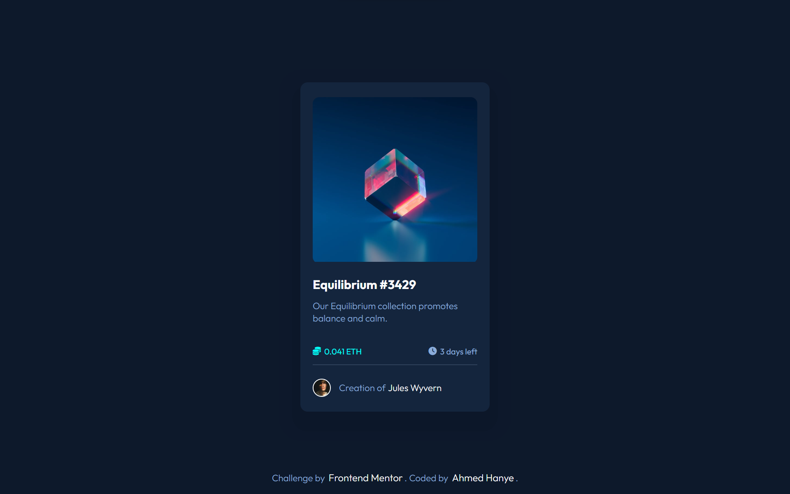

# NFT Preview Card Component

This project is a Frontend Mentor challenge solution, creating an NFT preview card component.

link to the website : https://ahmedhanye.github.io/nft-preview-card-component-main/

## Table of Contents
- [Project Overview](#project-overview)
- [Demo](#demo)
- [Features](#features)
- [Technologies Used](#technologies-used)

## Project Overview

This project is a solution to the Frontend Mentor challenge, which involved creating an NFT preview card component. It showcases a fictional NFT collection called "Equilibrium" and provides details about the collection and its creator.

## Demo

You can see the live demo of this project [here](#).

## Features

- Display of NFT image and collection details.
- Information about the collection's theme and promotion.
- Price and remaining time for the NFT.
- Creator's name and avatar.

## Technologies Used

- HTML5
- CSS3
- Font Awesome for icons

