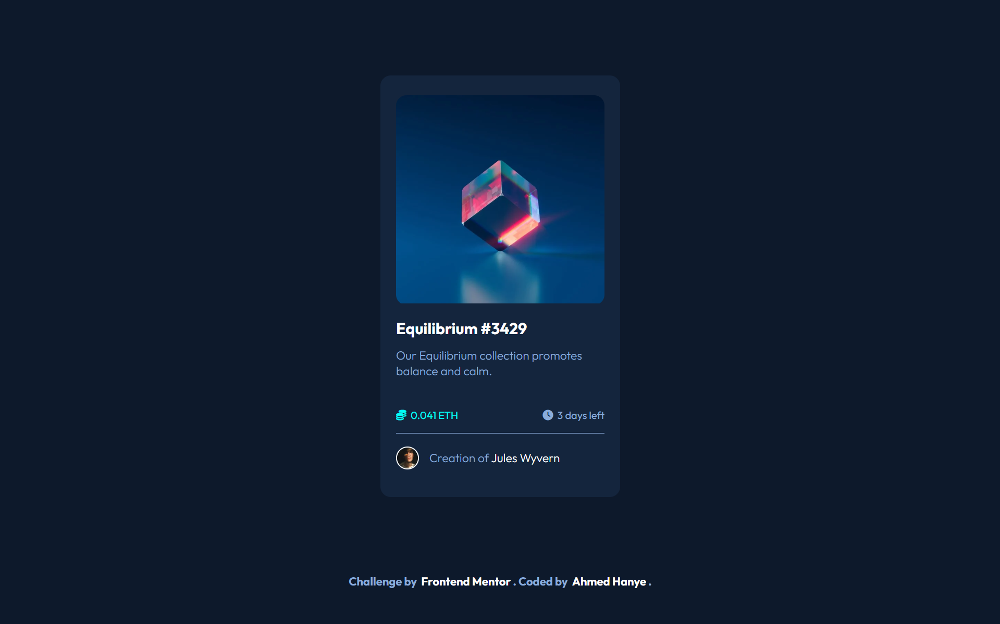

# NFT Preview Card Component



## Description

this component is a solution to a challenge from Frontend Mentor. The challenge is to build NFT Preview Card Component and make it look as close to the design as possible.

## Technologies

- HTML
- CSS
- batch

## How to use

- Clone the repository

```bash
https://github.com/AhmedHanye/nft-preview-card-component-main.git
```

- Open the `index.html` file in your browser

## Frontend Mentor

This project is a solution to a challenge from Frontend Mentor. [Frontend Mentor](https://www.frontendmentor.io) challenges help you improve your coding skills by building realistic projects.
